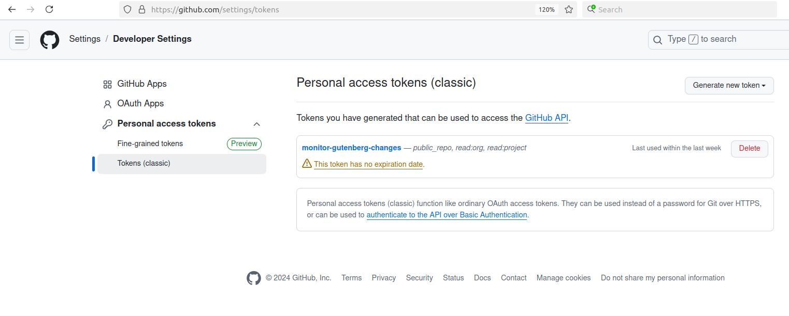
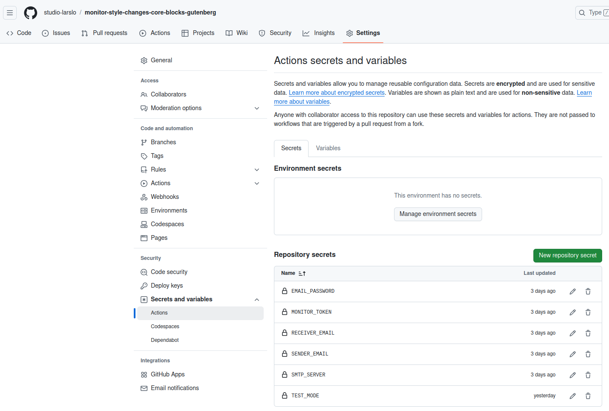

# GitHub Release Monitor for Gutenberg Core Blocks

Monitor style and view changes in WordPress Gutenberg core blocks between releases. Get email notifications when critical frontend files change (e.g. style.scss, view.js, block.json).


## Why This Exists

As the Gutenberg editor evolves, updates to markup, styles, and view.js files of core blocks occur periodically. When WordPress sites have auto-update enabled, these changes can unexpectedly affect your site's appearance.

Common issues include:
- Modified default styles affecting layout
- Updated view.js files changing block behavior
- Undocumented frontend changes hidden in lengthy changelogs

This tool helps you stay informed about frontend-relevant changes, allowing you to:
- Proactively test affected blocks before they reach production
- Prevent layout glitches from auto-updates
- Focus on changes that matter for site appearance
- Skip through lengthy changelogs

## What it Monitors

Specifically tracks changes in these critical frontend files:
- `*.scss` files - Style changes that affect block appearance
- `view.js` files - Frontend JavaScript that controls block behavior
- `block.json` - Block configuration that can affect rendering
- Other frontend-related files in `packages/block-library/src/`

The focus is on files that directly impact how blocks render on your site's frontend.

## What it does

- 🔍 Monitors changes between GitHub releases of Gutenberg Plugin
- 📁 Focuses on specific file patterns (e.g., style files, view files, block.json)
- 📧 Sends email notifications with detailed change reports
- 🔗 Provides direct links to file changes
- 🤖 Runs automatically via GitHub Actions


## How it Works

1. Runs daily via GitHub Actions
2. Compares latest Gutenberg release with previous version
3. Filters for frontend-relevant file changes
4. Sends email report if changes are found
5. Provides direct links to changed files

## Setup


### 1. Fork/Clone this repository

```bash
git clone https://github.com/yourusername/github-release-monitor.git
```

### 2. Configure GitHub Secrets

#### 2.1 make sure you have a github personal access token
github personal access token via github gui:


#### 2.2 add the secrets to your repository
Add these secrets to your GitHub repository (Settings → Secrets and variables → Actions):



```bash
gh secret set GITHUB_TOKEN      # GitHub Personal Access Token with repo access
gh secret set SMTP_SERVER       # SMTP server address (e.g., smtp.gmail.com)
gh secret set SENDER_EMAIL      # Email address to send from
gh secret set RECEIVER_EMAIL    # Email address to send to
gh secret set EMAIL_PASSWORD    # SMTP password/app password


```
## Demo E-Mail send (showing changes between 19.6.4 and 19.7.0)
```
# Release Comparison Report

New Release: v19.7.0
Released on: 2024-11-20 17:16:49+00:00

## Summary
- Added: 0 files
- Modified: 9 files
- Removed: 0 files

## Changed Files (Overview)

### Modified:
- packages/block-library/src/comments/block.json (12 changes)
- packages/block-library/src/cover/style.scss (56 changes)
- packages/block-library/src/details/block.json (1 changes)
- packages/block-library/src/image/block.json (2 changes)
- packages/block-library/src/image/style.scss (1 changes)
- packages/block-library/src/media-text/style.scss (2 changes)
- packages/block-library/src/post-content/block.json (15 changes)
- packages/block-library/src/post-template/block.json (3 changes)
- packages/block-library/src/query/block.json (2 changes)

## Detailed Changes (with links)
How to use: Click on 'Files changed' and wait for second (page might be huge)

### Modified Files:
packages/block-library/src/comments/block.json:
[View changes](https://github.com/WordPress/gutenberg/compare/v19.6.4...v19.7.0/#diff-d364038a7b03f8bf24e42fa597bcc0c62e41530eb944da6e74f706aeeacf4e5e)
...
```
